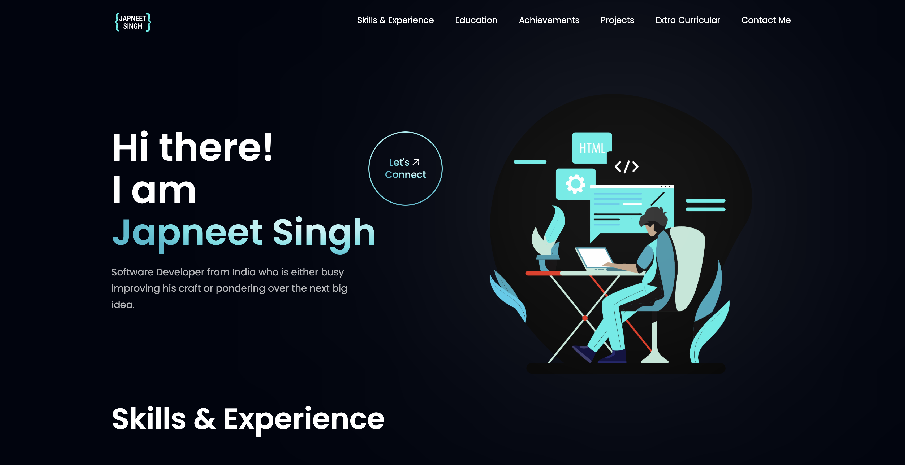

<h1 align="center"> Personal Portfolio </h1>

### Deployed link: https://japneet-singh.netlify.app/

    

## Tech Stack 🧰
Japneet Singh
<li>Frameworks</li>

- [ReactJS](https://reactjs.org/)
- [Tailwind CSS](https://tailwindcss.com/)

<li>Libraries/Tools</li>
    
- [ViteJS](https://vitejs.dev/)
- [React Icons](https://react-icons.github.io/react-icons")
- [Framer](https://www.framer.com/)
- [React Lottie](https://www.npmjs.com/package/react-lottie)
- [Meraki UI](https://merakiui.com/components/)

 

## Implemented Sections ☑️

- Hero Section
- Skills & Experience
- Education
- Projects
- Blogs
- Open Source Contributions
- Extra Curricular
- Contact Me

## Installation Guide 🧑‍💻

### Install required packages

- `npm install`

### Run server

- `npm run dev`

 

